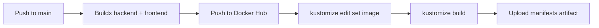

# DevOps Guide

## Local development

### Prerequisites

- Python 3.12+
- Node.js 20+ (for frontend)
- Docker (for K8s local testing with kind/k3d)

### Python setup

```bash
python -m venv .venv
source .venv/bin/activate
pip install -e .
```

### Run the pipeline locally

```bash
python run_pipeline.py --all --target inventory
```

### Frontend dev server

```bash
cd frontend/chatbot
npm install
VITE_API_URL=http://localhost:8000 npm run dev
```

The catalog static HTML is served at `frontend/catalog/`.

## Building containers

```bash
docker build -t ecommerce-backend -f Dockerfile.backend .
docker build -t ecommerce-frontend -f Dockerfile.frontend .
```

## Kubernetes deployment

### Prerequisites (cluster)

- Kubernetes 1.28+
- [External Secrets Operator](https://external-secrets.io) v0.9+
- A storage class supporting `ReadWriteOnce` (and `ReadWriteMany` if using NFS/EFS for CSV/chroma PVCs)

### Deploy everything

```bash
kustomize build k8s/ | kubectl apply -f -
```

This creates the `ecommerce` namespace and all resources: PostgreSQL, MinIO, ChromaDB, pipeline CronJob, chatbot/catalog APIs, frontend, ingress, Vault, and ExternalSecrets.

### Deploy order (manual, if deploying individually)

1. `kubectl apply -f k8s/namespace.yaml`
2. StatefulSets: PostgreSQL → MinIO → ChromaDB
3. PVCs, ConfigMaps, RBAC
4. Pipeline CronJob
5. Backend Deployments (chatbot + catalog)
6. Frontend Deployment
7. Ingress + HPA
8. Vault resources + bootstrap Job
9. SecretStore + ExternalSecrets

### Verify deployment

```bash
kubectl -n ecommerce get pods
kubectl -n ecommerce get svc
kubectl -n ecommerce get pvc
kubectl -n ecommerce get secrets
```

### Check bootstrap progress

```bash
kubectl -n ecommerce logs job/vault-bootstrap -f
kubectl -n ecommerce wait --for=condition=ready pod -l app=vault --timeout=120s
kubectl -n ecommerce get secret postgres-credentials minio-credentials
```

## CI/CD pipeline

The GitHub Actions workflow (`.github/workflows/build-deploy.yml`) runs on every push to `main` and PRs targeting `main`:



### Required GitHub secrets

| Secret | Purpose |
|---|---|
| `DOCKER_USERNAME` | Docker Hub login |
| `DOCKER_PASSWORD` | Docker Hub login |

The pipeline does **not** handle application secrets (PostgreSQL, MinIO). Those are provisioned at runtime by Vault + External Secrets Operator.

### Artifact consumption

The rendered `k8s-manifests.yaml` artifact can be:
- Applied directly: `kubectl apply -f k8s-manifests.yaml`
- Consumed by ArgoCD / Flux pointing to the artifact URL
- Downloaded from GitHub Actions and inspected offline

## Useful commands

```bash
# Watch all pods in namespace
kubectl -n ecommerce get pods -w

# Stream logs
kubectl -n ecommerce logs -l app=chatbot -f
kubectl -n ecommerce logs deployment/catalog -f
kubectl -n ecommerce logs job/vault-bootstrap -f

# Execute in a pod
kubectl -n ecommerce exec deploy/chatbot -- python -c "import requests; print('ok')"

# Port-forward for local testing
kubectl -n ecommerce port-forward svc/chatbot 8000:8000
kubectl -n ecommerce port-forward svc/postgres 5432:5432

# Trigger pipeline manually
kubectl -n ecommerce create job --from=cronjob/mlops-pipeline manual-run

# Scale
kubectl -n ecommerce scale deployment/chatbot --replicas=0
kubectl -n ecommerce scale deployment/chatbot --replicas=3
```

## Troubleshooting

| Symptom | Likely cause | Check |
|---|---|---|
| Pod stays `Pending` | PVC not bound / resource limits | `kubectl describe pod <name>` |
| CrashLoopBackOff | Secret not found / env var missing | `kubectl logs <name>` |
| Pipeline Job fails | MinIO or PostgreSQL not reachable | Check Service DNS, secrets |
| Vault not ready | Bootstrap Job not run yet | `kubectl -n ecommerce logs job/vault-bootstrap -f` |
| ExternalSecrets not syncing | Vault sealed / auth misconfigured | `kubectl -n ecommerce get externalsecret -o yaml` |
| Ingress returns 404 | Ingress controller not installed | Check `kubectl get ingressclass` |
